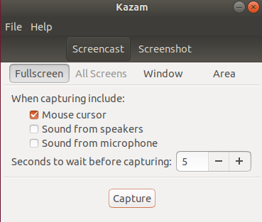

## 截图工具---Flameshot
Ubuntu自带的截图工具没有对截图进行操作的功能，这我忍不了。
Flameshot功能概述：
- 注释 (高亮、标示、添加文本、框选)
- 图片模糊
- 图片裁剪
- 上传到 Imgur
- 用另一个应用打开截图
我主要使用的是它的截屏后对图片进行标出高亮or在图片上画框的功能。

在终端上进行安装：
```shell
sudo apt install flameshot
```


## 录屏工具---Kazam
Ubuntu自带的录屏工具出来的格式是webm，后续对其进行剪辑时还要转换成mp4文件，太麻烦，换一个！
如果你对命令行不太舒服，而你只想要一个简单的屏幕录像机，可以截屏你的屏幕自由区域，选择Kazam。UI 非常简单而直观。与 GNOME 不同，您只需点击一个复选框来切换音频录制。它支持录音从麦克风以及扬声器。

Kazam 还允许您使用帧速率和视频编解码器进行一些自定义。它支持 RAW、无损 JPEG、WEBM、H.264 视频编解码器。Kazam 是专为极简用户和只需要一点点功能的人而构建的。

在终端进行安装：
```shell
sudo apt install kazam
```


